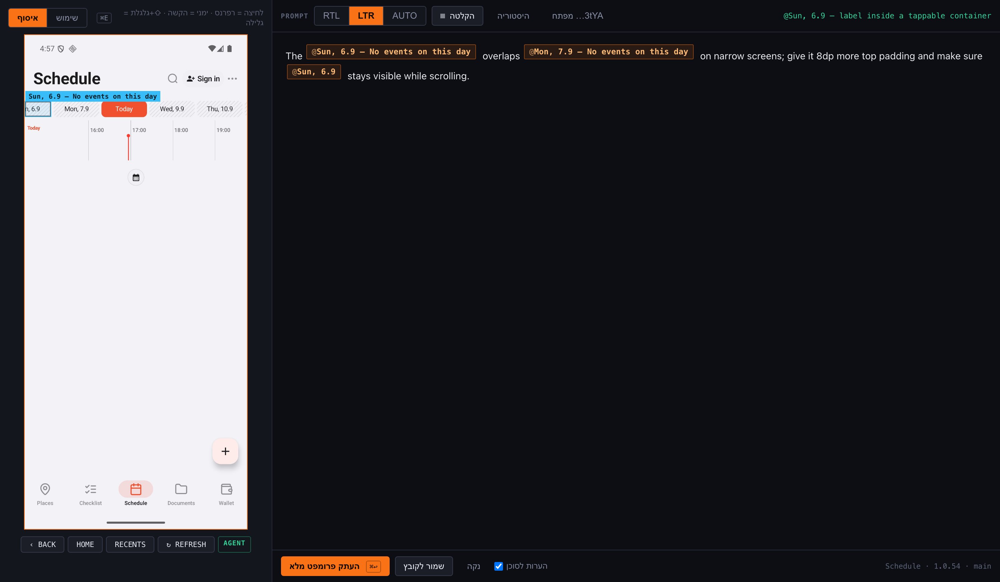

# emu-composer

> Point at the button. Get the line of code. Say what's wrong. Paste.

Coding agents are good at changing an Android app once they know *which* element you mean.
Telling them is the slow part: you describe a button in words, they grep for it, you correct
them. emu-composer removes that round trip. It puts a prompt box next to a live Android
emulator; every click on the screen drops an `@reference` into your text that carries the
element's role and position, the **string resource and the source line that render it**, and
the state of the device, build and repo. You write around the references — or dictate — and
copy one prompt that an agent can act on without asking where anything is.

```
npx emu-composer init          # in your Android project: detects package, sources, strings
npx emu-composer               # boots an AVD if needed, starts the server, opens the page
```



*Left: the emulator, live. Right: the prompt. The chips are references; the block each one
expands to is below.*

## What a reference looks like

```
### @ui1 — "Schedule"  (label of the selected tab)
what:     label of the selected tab · TextView · bottom bar, centre · 3 of 5 in its row
screen:   Schedule
bounds:   [485,2259]→[595,2289] (110×30px)
state:    selected (the container is the selected one)
tap:      its container View [441,2127]→[640,2337] — currently selected, so it has no click action
copy:     R.string.tab_schedule (on screen: default)
          default "Schedule" · he "לוז" · es "Agenda"
          defined app/src/main/res/values/strings.xml:14
rendered: app/src/main/java/com/example/ui/RootScreen.kt:401
          Text(stringResource(R.string.tab_schedule))
also:     ui/guest/GuestShell.kt:601, ui/UsageGuideScreen.kt:278
```

The full prompt is `# Task` (your text, with `@ui1`… inline) → `# Elements` (one block per
chip) → `# Screen` (app, build, device, repo, session — nothing guessed; derived facts say
so) → `# Notes for the agent` (three lines of project convention, generated from your
config). Copy it with `⌘↩`.

Text the app builds at runtime resolves to nothing; the block says so and names the nearest
text that *does* resolve as an anchor. Printf-shaped copy template-matches (`"Error (404)"`
→ `error_with_status`). A label inside a button reports the button as its `tap:` target.
Compose's selected tab has no click action — the block says that too, rather than "not
tappable". Keys that share the same copy are ranked by the row they sit in: when four
sibling tabs resolved to `LShell.*` in `RootScreen.kt`, the fifth is theirs too — never the
CarPlay or widget variant. Each block names the screen it was picked on, and the prompt says
when elements come from several screens.

## Two modes, one toggle (`⌘E`)

| | a click… | also |
|---|---|---|
| **collect** | inserts a chip for the element under the cursor | right-click taps the device without leaving collect · ⇧wheel scrolls it |
| **use** | goes to the device — taps, drags, wheel, keyboard | any character, including RTL scripts |

The prompt box is a normal rich-text field: select, cut, paste, undo, RTL/LTR. A chip is one
reference — click it to copy that reference alone, hover it to see the element, delete it
and its block leaves the prompt. Drafts survive a reload; every copied prompt goes to a
history.

**Dictation** (`⌘⇧R`): segments are cut at pauses, not on a timer, so words are not split;
an interim marker goes in at the caret the moment a segment is cut and the transcript
replaces it, so text lands where the caret *was* even if you kept typing. Needs an OpenAI
key, entered once in the page and stored at `~/.config/emu-composer/openai-key` (mode 600) —
the page never receives it back.

## Why it is fast: the on-device agent

`uiautomator dump` costs **2.5 s per call** — a fresh JVM every time, a fixed cost no screen
state changes. The optional agent (uiautomator2's `u2.jar`, run with `app_process` and spoken
to over JSON-RPC through an adb forward) changes the numbers:

| | `uiautomator dump` | agent |
|---|---|---|
| tree dump | 2.5 s | 0.2 s |
| frame | 0.13 s PNG | 0.05 s JPEG |
| tap / swipe / key | ~0.1 s each | ~50 ms |
| text | ASCII only | any Unicode (clipboard + paste) |

```
npx emu-composer setup-agent   # once; pip-installs uiautomator2 into an isolated venv and
                               # copies the jar out. Nothing else is downloaded, ever.
```

Without the jar everything works on the slow path and the **AGENT** pill says so. With it,
the lifecycle is self-healing — drilled, not assumed: a wedged agent (`kill -STOP`) costs one
slow capture and then comes back by itself; a killed one (`kill -9`) is back in seconds with
no request in flight; three server restarts in a row all land on the fast path. Teardown is
SIGTERM first, SIGKILL after 1.5 s: a storm of SIGKILLed UiAutomation clients once left an
emulator's AccessibilityManagerService dead, and only a reboot fixed it.

## Opening it later

- `npx emu-composer` from the project. Idempotent: a running server is reused, so an open
  composer keeps its draft.
- **macOS:** `emu-composer install-app` writes *"<App> Composer.app"* to `~/Applications` —
  Spotlight finds it, the Dock can hold it, and it boots the AVD when none is running.
- **macOS:** `emu-composer bar` builds and starts a small floating bar that docks itself to
  the emulator window (the standalone emulator's `qemu-system-*` window) and follows it: one
  button, a status dot, a menu-bar icon to hide/show it. `--login` adds it to Login Items.

## Configuration — `emu-composer.json`

`init` detects the usual layout. Everything is overridable:

```jsonc
{
  "package": "com.example.app",            // applicationId (required)
  "appName": "Example",
  "sourceRoots": ["app/src/main/java/com/example"],
  "strings": { "resolver": "android-xml", "resDirs": ["app/src/main/res"] },
  // or, for a Kotlin string registry:  { "resolver": "lkey", "langs": ["he","en","es"], "files": "/l10n/|Strings\\.kt$" }
  "versionFile": "app/build.gradle.kts",   // declared version vs. installed — mismatch is a WARNING line
  "signInLabels": ["sign in", "log in"],   // how the session line is derived
  "notes": null,                           // agent notes; null = generated from this file
  "port": 7788, "adb": "auto", "avd": "",
  "stt": { "model": "gpt-4o-transcribe", "language": "" }
}
```

Two string registries are understood today: standard `res/values*/strings.xml` (keys become
`R.string.x`; `@string/x` in layouts counts as a call site) and Kotlin objects of
`LKey(lang = "…")` values. Adding another is one class in `src/resolve.mjs`.

## Status

0.1.0 — extracted from a project-internal tool after daily use; see the
[changelog](CHANGELOG.md).

- [x] Collect / use modes, chips, full prompt, history, drafts
- [x] android-xml and lkey resolvers with tests
- [x] On-device agent with a drilled self-healing lifecycle
- [x] Dictation (OpenAI) with pause segmentation and caret anchoring
- [x] macOS launcher app and floating bar
- [ ] iOS Simulator (the same idea over `xcrun simctl` + the accessibility tree)
- [ ] Android Studio plugin for the embedded emulator
- [ ] Linux launcher (the server and page already run there)

## Requirements

Node ≥ 20, `adb` (found via `ANDROID_HOME`, `PATH`, or the usual SDK locations), an AVD or a
device. `setup-agent` needs `python3` once. The macOS extras need the Xcode command line
tools (`swiftc`).

## How it works, briefly

`adb` + the accessibility tree give every on-screen node with bounds, text, content-desc and
flags. The tree is rebuilt with parent links so a reference can name the tappable ancestor
and "3 of 5 in its row". On-screen text is looked up by exact value in an in-memory index of
the project's string resources, then followed to every call site of that key, ranked
(renders > maps; a file named after the current screen wins). Frames are polled one at a
time; input goes through one ordered queue and typed characters coalesce into one paste per
burst. No npm dependencies; the page is one HTML file.

## License

MIT.
